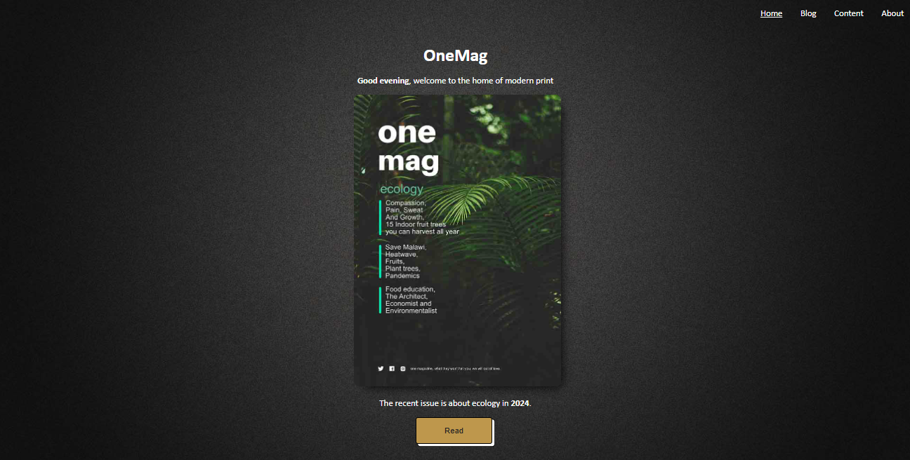
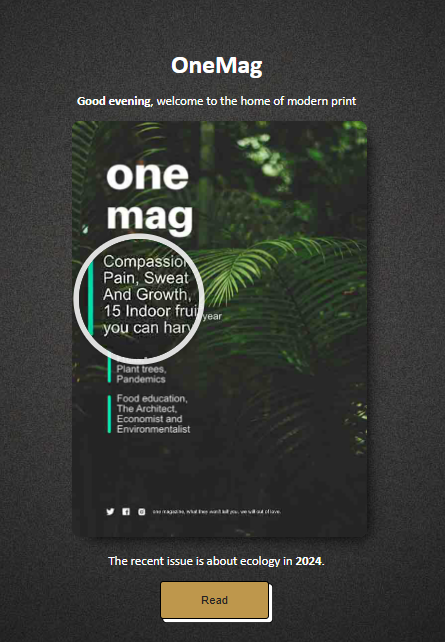
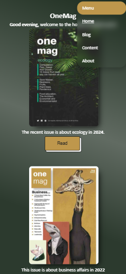

# One Mag 

This magazine is a special kind, it talks a bit more about different topics not short of business, technology and ecology.
There are more such as entertainment and phycology but they lean more into the binary side of life. What One Mag seeks to
achieve is awareness of the changing events in life far ahead of its time. There is a lot going on in the world, but it is
wise to be able to filter out the noise and concentrate on what really matters.

# Features
 - ### Image magnification on homepage
  

  This feature is only available on desktops or rather devices with a screen resolution over 1024px of width. This prevents the use of fingers to magnify content which gets blocked by the finger itself when reading. It works best using a mouse that disappears and leaves the magnification boundary.

   - ### Responsiveness for mobile devices
  

  This feature triggers when the screen resolution is below 1024px of width. This removes the picture based background and replaces it with a gradient for better processing, it also removes image magnification on the homepage and also makes sure works are not too larger and images are not out of place.